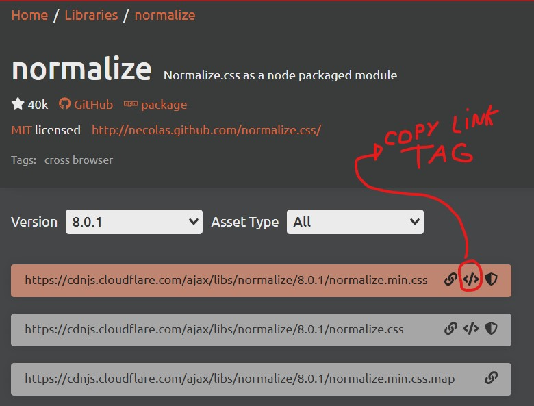

# Normalize.css

Uma alternativa moderna e compatível com HTML5 aos **resets** de CSS.

O Normalize.css faz com que os navegadores renderizem todos os elementos de forma mais consistente e em conformidade com os padrões modernos. Ele atua com precisão apenas nos estilos que precisam ser normalizados.

---

## Forma de adicioná-lo no projeto

1. Acesse o site [https://cdnjs.com/libraries/normalize](https://cdnjs.com/libraries/normalize);
2. Clique no botão `Copy Link Tag` do primeiro link dessa biblioteca, como mostra a imagem abaixo:
  
3. Vá para a estrutura HTML e cole o código dentro da tag head.

---

## Referências

- Para saber sobre o **Normalize.css** de forma resumida, [clique aqui](https://necolas.github.io/normalize.css/);
- Para saber mais sobre o **Normalize.css** de forma completa, [clique aqui](https://nicolasgallagher.com/about-normalize-css/);
